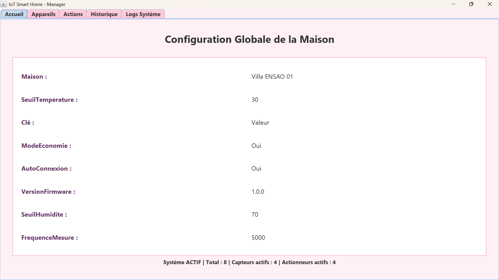
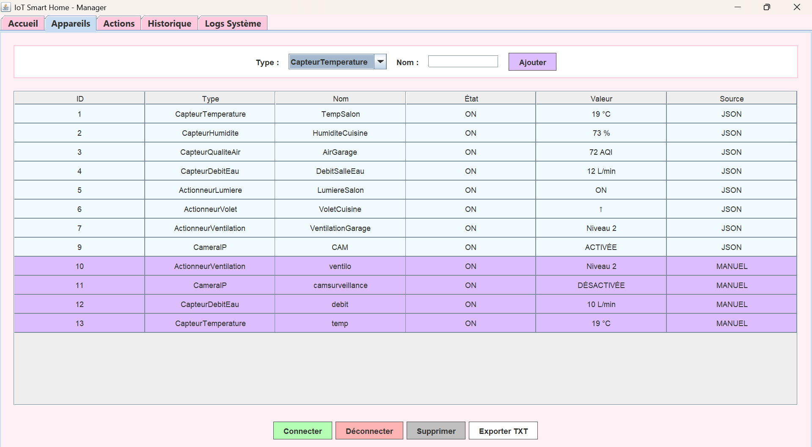
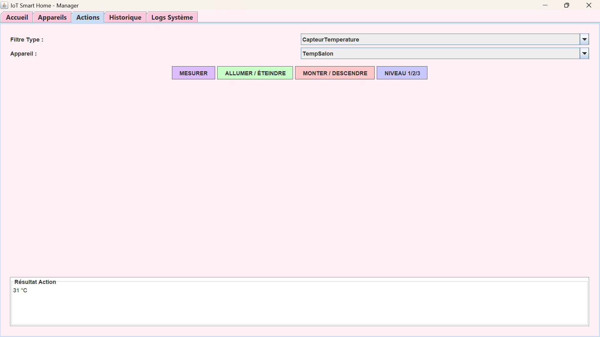
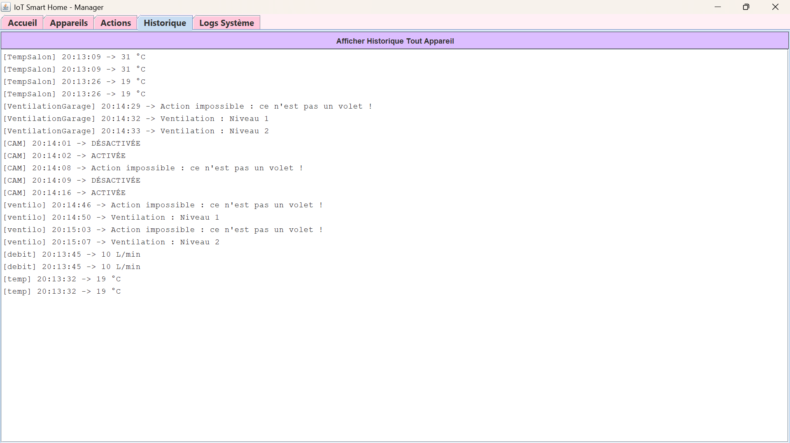
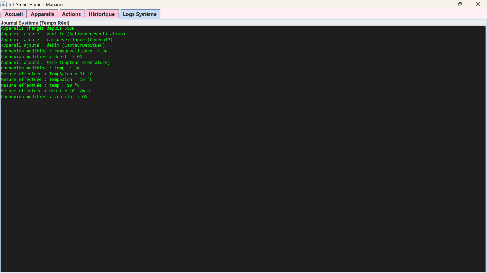

# 🏠 IoT Smart Home - Manager

Ce projet est une application Java de bureau complète permettant de simuler et de gérer un réseau domestique IoT (Internet of Things) intelligent. Il a été développé dans le cadre d'un mini-projet universitaire (ENSAO) pour synthétiser les concepts avancés de la Programmation Orientée Objet (POO).

## 🎯 Fonctionnalités Principales

L'application permet le contrôle complet d'une maison intelligente à travers une interface graphique intuitive séparée en plusieurs onglets :

* **📊 Dashboard (Accueil) :** Affichage en temps réel des paramètres globaux de la maison (chargés depuis une configuration) et des statistiques du système (appareils actifs, etc.).
* **🔌 Gestion des Appareils :** Visualisation dans un tableau dynamique (JTable). Permet d'ajouter, connecter/déconnecter, supprimer et exporter la liste au format TXT.
* **⚙️ Actions & Contrôle :** Permet de mesurer les données des capteurs et de piloter les actionneurs avec des retours d'état précis.
* **🕒 Historique :** Suivi chronologique de toutes les mesures effectuées par les capteurs.
* **📝 Logs Système :** Journal d'événements en temps réel (connexions, erreurs, actions utilisateur).

## 🛠️ Architecture & Technologies

Le projet est strictement structuré selon le motif de conception **MVC (Modèle-Vue-Contrôleur)** :

* **Langage :** Java (JDK 17)
* **Interface Graphique (Vue) :** Java Swing
* **Architecture Métier (Modèle) :**
  * Utilisation avancée de la POO : Héritage, Classes abstraites (`AppareilConnecte`), Interfaces et Polymorphisme.
  * Gestion personnalisée des erreurs (`AppareilException`, `ConnexionException`, etc.).
* **Persistance des Données :**
  * Sérialisation **JSON** (via `Gson`) pour sauvegarder l'état des appareils entre chaque session.
  * Lecture de configuration via fichiers externes (Excel/Properties via `Apache POI`).

## 📡 Appareils Simulés

L'application simule le comportement physique de plusieurs types d'équipements :

**Capteurs (Mesures aléatoires réalistes) :**
* 🌡️ **Température :** 15 – 30 °C
* 💧 **Humidité :** 30 – 90 %
* 💨 **Qualité de l'air :** 0 – 100 AQI
* 🚰 **Débit d'eau :** 1 – 20 L/min

**Actionneurs (Contrôle d'état) :**
* 💡 **Lumière :** ON / OFF
* 🪟 **Volet Roulant :** Monter (↑) / Descendre (↓)
* ❄️ **Ventilation :** 3 Niveaux de puissance
* 📷 **Caméra IP :** Activée / Désactivée

## 📸 Aperçu de l'Application

### 1. Tableau de Bord (Configuration Globale)

*Vue principale affichant les paramètres globaux de la maison.*

### 2. Gestion des Appareils

*Ajout, suppression et contrôle des équipements avec système d'exportation.*

### 3. Panneau de Contrôle (Actions)

*Interaction en direct avec les capteurs et actionneurs.*

### 4. Historique & Logs
  

*Suivi détaillé des actions et événements du système.*

## 🚀 Comment tester l'application ?

Vous n'avez pas besoin d'un Environnement de Développement (IDE) pour tester le projet !

1. Allez dans la section **Releases** à droite de cette page GitHub.
2. Téléchargez le fichier `.zip` de la dernière version (ex: `SmartHome_Manager_v1.0.zip`).
3. Décompressez l'archive sur votre ordinateur.
4. Double-cliquez sur le fichier **`iot_test.jar`** pour lancer la simulation.
*(Note : Assurez-vous d'avoir Java installé sur votre machine).*

---
*Projet réalisé dans le cadre du module de POO Java - GSEIR4 - ENSAO.*
